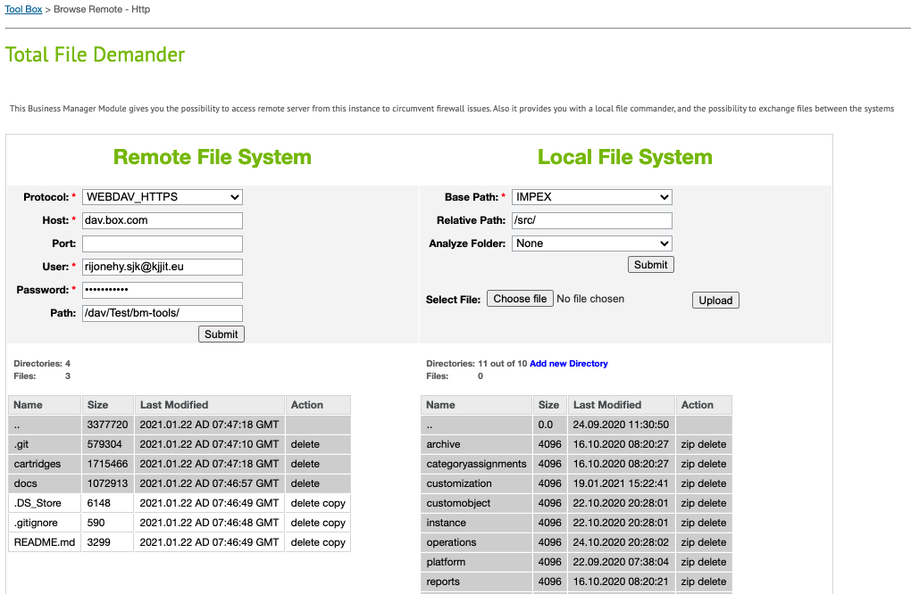
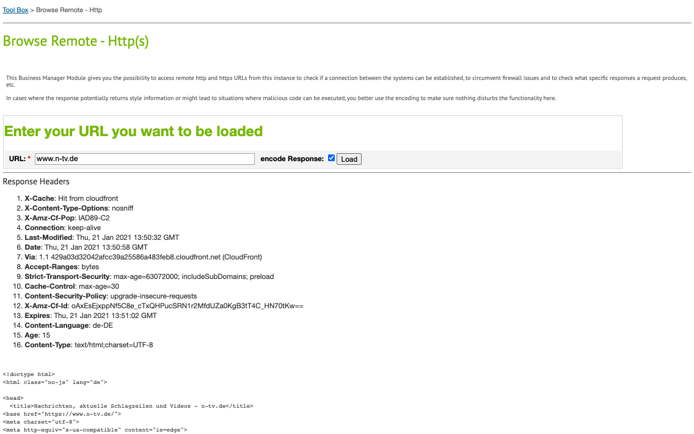
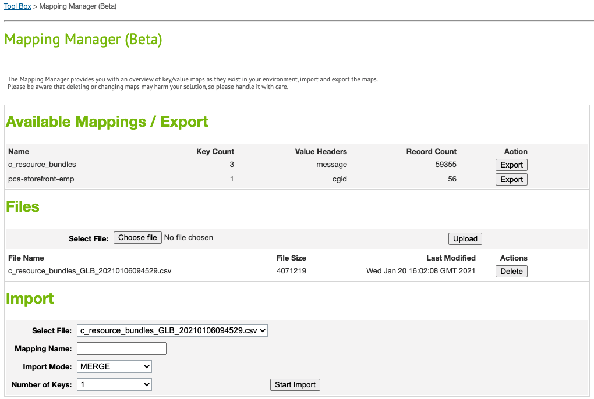
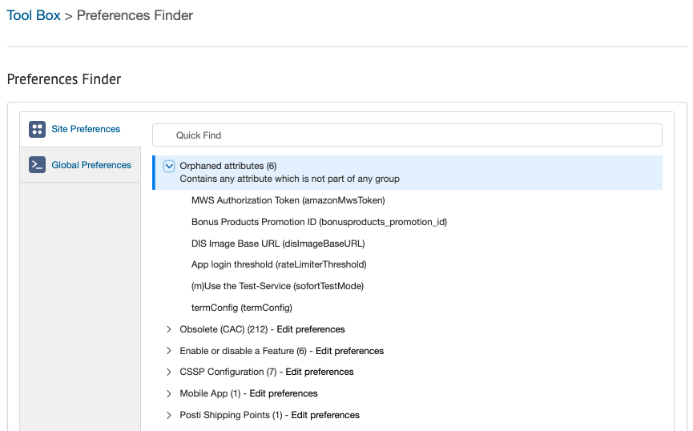
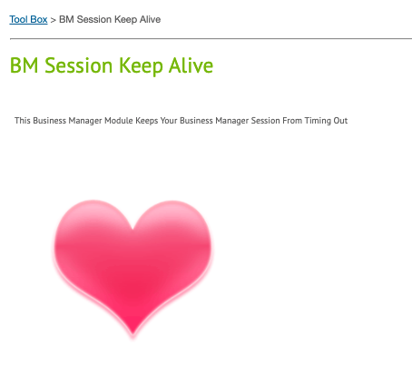

Business Manager Tools
==============

The bm_tools cartridge is a cartridge that provides a collection of tools, set out to make the lives of developers and operators easier.

It currently contains:

# Total File Demander

This tool provides you with an Explorer like user interface that's split into two different panels!

## Remote File System - The left part
This panel helps you to access remote files systems - FTP, SFTP or WebDAV. This way you can:
* Determine if a connection between your current instance and the remote server can be established
* See, what directories and files the remote folder contains
* Copy single files to the currently selected location on your instance; folders are not supported
* Delete directories and/or files directly in the remote location

## Local File System - The right part
This panel represents the file system of the application server you are connected to. With it, you can;
* Navigate all directories, which are accessible via Script API
* Upload files to and download files from those directories
* Zip and unzip files and directories right where they are currently located ... on the server in the folder
* Delete directories and files and create new directories
* Run three different analysis on the current directory - "Sub Directory Size", "File Extensions" and "File Extensions per Sub Directory"

# Browse Remote - Http(s)
This tool can be used to issue and visualize the result of simple http(s) calls from the current instance to the remote server to either circumvent firewall restrictions on either end, test that the connection between both systems can be established, check the result/payload of the very request is, and for other purpose you may think of.

# Mapping Manager
The Mapping Manager provides you with an overview of key/value maps as they exist in your environment, import and export the maps and, via DELETE import, you can even get rid of those maps.
Please be aware, that deleting or changing maps may harm your solution, so please handle it with care.

# Terminal
This tool can be used whenever you want to try out a few, very basic code instructions, without pulling up an IDE. It can also be used in environments, where you cannot directly connect to. When using it, you should try to limit your actions to read-only operations.

For a bare minimum, you should make use of the following instructions:
* **init** - Resets the instruction stack
* **trace({myExpression})** - Prints out the result of the expression
* **clear** - Clears the screen

There are two ways of using this tool:
* **Business Manager:** - The agent has to have the permission to access this tool. All instructions are executed in the scope of the site **Sites-Site**
* **Storefront:** - For the storefront site, the agent has to have the functional permission **Login_Agent**. All instructions are executed in context of the respective storefront site. To access this tool, the cartridge has to be assigned to this site. If that is the case, you can use https://{your-host-name}/on/demandware.store/Sites-{your-site-id}-Site/default/Terminal-Start to start your terminal session

**Please note:** Using this tool on PIG instances may violate standards like PCI-DSS, SOC and other. So please use it with care.

# Preferences Finder
It's sometimes a rather laborious task to find a specific Custom Site or Organization Attribute in its respective preference group. The worst case would be, that this attribute has been remove from or never assigned to one of the groups. The Preference Finder helps you with your endeavor.

# BM Session Keep Alive
This tool implements a recuring ping request, that can keep you Business Manager session alive for up to 6 hours. In order to keep the session alive, you need to open this screen in a separate tab so it would work in the background while you are concened with other matters in the Business Manager.

**Please note:** Using this tool on PIG instances may violate standards like PCI-DSS, SOC and other. So please use it with care.

# Easy Installation
Please follow the following steps to activate this cartridge in your environment:
* Download the code / cartridge(s) (see dependencies)
* Upload to the instance via IDE of your choice
* Assign the cartridge to Sites-Site cartridge path (organization level)
* Assign appropriate permissions to respective roles; there is one permission per tool

As soon as you have set the right permissions, you can start using the tools.

## Dependecies

* [Community Suite Library](https://github.com/SalesforceCommerceCloud/demandware-library)

## Contributing

1. Create a fork, if you don't already have one
2. Ensure your fork is caught up (message from Bitbucket shows up on your fork main page, if you are not current on commits)
3. Create a new branch in your fork to hold your changes
4. Submit a [pull request](https://github.com/SalesforceCommerceCloud/bm-tools/pulls)
